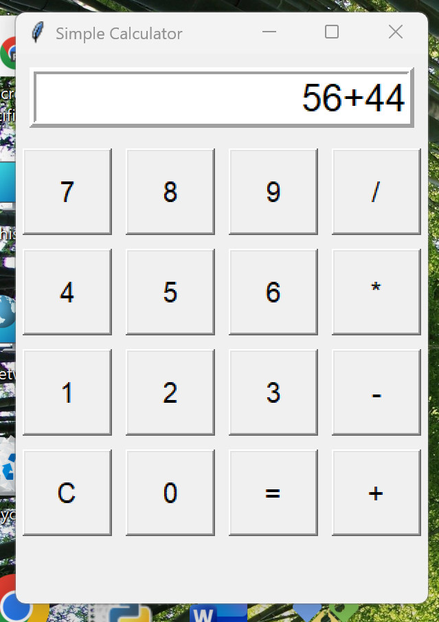

# 🧮 Python Tkinter Calculator

A simple desktop calculator application developed using **Python and Tkinter**.

## ✨ Features

- Addition
- Subtraction
- Multiplication
- Division
- Clear button
- Error handling
- Simple graphical user interface

## 🛠️ Technologies Used

- Python
- Tkinter

## 📸 Project Screenshot



## ▶️ How to Run

### Using Python

Make sure Python is installed, then run:

```bash
python calculator.py
